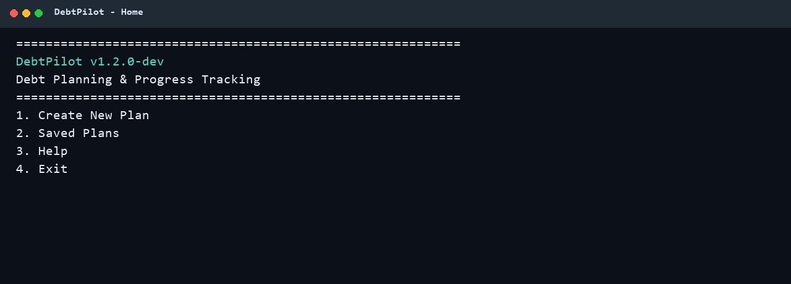
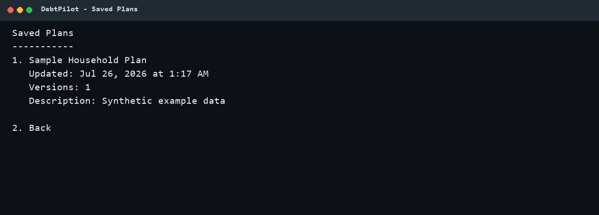
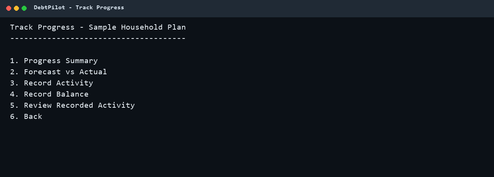
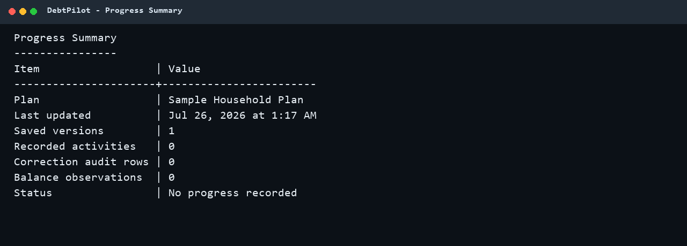
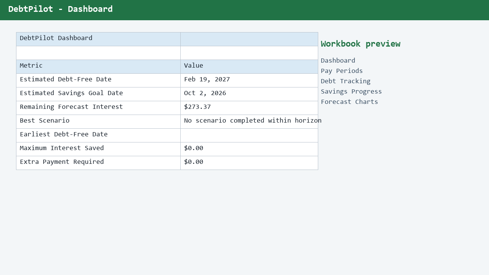

# DebtPilot

*Debt Planning & Progress Tracking*

DebtPilot is a local-first Python application for building paycheck-based debt
payoff plans, comparing forecasts with real progress, and preserving the history
of a plan as it changes. It combines debt snowball planning, savings goals,
calendar-aware scheduling, progress tracking, and Excel reporting in one guided
console application.


## What DebtPilot Does

- Builds paycheck-by-paycheck budget and debt payoff forecasts
- Applies the debt snowball strategy with interest and minimum payments
- Schedules bills using real calendar dates
- Tracks emergency savings and dated savings goals
- Saves multiple plans and immutable plan versions
- Compares forecasted activity with recorded actual activity
- Records debt and savings balance observations
- Preserves corrections and reversals as an audit trail
- Exports detailed Excel workbooks with dashboards and charts
- Stores local history in SQLite using exact integer-cent money storage

## Quick Start

### Windows Installer (Recommended)

Most users should install DebtPilot from the
[GitHub Releases page](https://github.com/jacobroberts9446-create/Debtsnowball/releases).

1. Download `DebtPilot-Setup-1.2.0.exe`.
2. Run the installer.
3. Open **DebtPilot** from the Start Menu.

Python is not required when using the installer.

### Run from Source

Requirements:

- Python 3.12 or 3.13
- Windows, macOS, or Linux

Clone the existing repository and enter it:

```bash
git clone https://github.com/jacobroberts9446-create/Debtsnoball.git
cd Debtsnoball
```

Create a virtual environment:

```bash
python -m venv .venv
```

Activate it:

```powershell
# Windows PowerShell
.\.venv\Scripts\Activate.ps1
```

```bash
# macOS or Linux
source .venv/bin/activate
```

Install dependencies:

```bash
python -m pip install -r requirements.txt
```

Launch DebtPilot:

```bash
python run.py
```

## First Plan

The interactive menu is the normal starting point:

```text
DebtPilot v1.2.0-dev
Debt Planning & Progress Tracking

1. Create New Plan
2. Saved Plans
3. Help
4. Exit
```

Choose **Create New Plan** to enter:

1. Plan name and paycheck schedule
2. Debts, balances, APRs, minimums, and due dates
3. Recurring bills
4. Personal spending
5. Current savings and emergency-fund target
6. Savings strategy

DebtPilot generates the plan in memory and opens the Results Viewer. Review the
summary, debt payoff order, budget, and forecast timeline before saving.

Type `cancel` at an interactive setup prompt to leave the current setup safely.
Where a **Back** option is shown, it returns one logical step and keeps the
information already entered whenever practical.

## Screenshots

### Home



### Saved Plans



### Track Progress



### Progress Summary



### Workbook



## Savings Strategies

The guided setup offers:

- **Build Emergency Fund First**: prioritizes the configured savings target.
- **Split Between Savings and Snowball**: uses the supported split behavior.
- **Maximum Snowball**: directs available extra cash to debt.
- **Custom**: applies user-entered savings and snowball percentages totaling
  100%.

All financial calculations use `Decimal` and round money to cents with
`ROUND_HALF_UP`.

## Saved Plans And History

The **Saved Plans** menu lists independent plans. A selected plan provides:

- Latest plan summary
- Excel workbook generation
- New-version creation
- Version history
- Rename, duplicate, and delete actions
- Progress tracking

Versions are immutable snapshots. Restoring an older version creates a new
version rather than rewriting history. Actual progress remains associated with
the plan and is compared with the active forecast.

## Progress Tracking

Choose **Saved Plans**, select a plan, and open **Track Progress**.

DebtPilot can record:

- Income received
- Bill payments
- Debt payments
- Savings deposits and withdrawals
- Personal spending
- Signed adjustments
- Debt balance observations
- Savings balance observations

The Progress Summary and Forecast vs Actual screens distinguish complete from
partial actual data. Debt observations are matched to the appropriate forecast
debt. Corrections are atomic: the original entry remains, a linked reversal is
created, and a replacement entry is added in one transaction.

Savings withdrawals reduce net savings contributions and increase remaining
cash in Forecast vs Actual reporting. Progress counts show user-recorded
activities separately from correction and reversal audit rows.

## Excel Workbooks

Workbook generation creates:

```text
output/debtpilot_plan.xlsx
```

The workbook includes the available planning and reporting views, such as:

- DebtPilot Dashboard
- Pay Period Summaries
- Active Debts
- Paid-Off Debts
- Savings Progress
- Forecast
- Scenario Comparison
- Debt-Free Target, when configured
- History and comparison sheets for history-report exports

Excel is a presentation boundary. Calculations are completed in Python before
values are written. Money cells are numeric, while the application keeps
financial values as exact `Decimal` objects internally.

## Windows App

### Installer

Download `DebtPilot-Setup-1.2.0.exe` from the
[GitHub Releases page](https://github.com/jacobroberts9446-create/Debtsnowball/releases)
and run it. The installer:

- installs for the current Windows user without administrator privileges;
- creates a Start Menu shortcut;
- offers an optional Desktop shortcut;
- registers DebtPilot with Windows for normal uninstall support; and
- preserves the same `%LOCALAPPDATA%/DebtPilot` data location used by the
  portable build.

DebtPilot can be removed from **Settings > Apps > Installed apps**. Removing the
application does not delete the financial data stored under
`%LOCALAPPDATA%/DebtPilot`.

### Build the installer

Install the development dependencies:

```powershell
python -m pip install -r requirements-dev.txt
```

Build the portable application:

```powershell
python scripts/build_windows.py
```

The result is:

```text
dist/DebtPilot/DebtPilot.exe
```

Install Inno Setup 6 or 7, then build the installer:

```powershell
python scripts/build_installer.py
```

The installer is written to:

```text
dist/installer/DebtPilot-Setup-1.2.0.exe
```

Use `INNO_SETUP_COMPILER` or `--compiler` when `ISCC.exe` is installed in a
nonstandard location. Use `--skip-app-build` to package an already-built
`dist/DebtPilot` folder.

### Portable build

Open the `dist/DebtPilot` folder and run `DebtPilot.exe` to use the one-folder
portable build without installing it.

### Local data

The packaged application stores writable data under:

```text
%LOCALAPPDATA%/DebtPilot
```

Default packaged paths are:

```text
%LOCALAPPDATA%/DebtPilot/output/debtsnowball.sqlite
%LOCALAPPDATA%/DebtPilot/output/debtpilot_plan.xlsx
%LOCALAPPDATA%/DebtPilot/output/preferences.json
```

The SQLite filename is intentionally retained for persistence compatibility.
The directory and all new user-facing output use the DebtPilot identity.

### Upgrading from DebtSnowball

DebtPilot was formerly named DebtSnowball. On the first packaged launch,
DebtPilot checks for:

```text
%LOCALAPPDATA%/DebtSnowball
```

When legacy data exists and `%LOCALAPPDATA%/DebtPilot` does not, DebtPilot:

1. Copies the complete legacy data tree to a temporary sibling directory.
2. Publishes the copy as the DebtPilot directory only after the copy succeeds.
3. Leaves the original DebtSnowball directory untouched.
4. Reports the successful migration before opening the menu.

Migration is idempotent. An existing DebtPilot directory is never overwritten,
and no manual data copy is required.

If both locations exist, DebtPilot explains that it will use the current
DebtPilot data and leave the legacy DebtSnowball data unchanged. A failed
migration also leaves the legacy data untouched and displays recovery guidance
for disk-space or folder-permission problems.

For automation, `DEBTPILOT_DATA_DIR` overrides the writable packaged data path.
The former `DEBTSNOWBALL_DATA_DIR` variable remains supported for backward
compatibility.

## Command-Line Tools

Interactive behavior is unchanged when no command is supplied:

```bash
python run.py
```

Show all command-line options:

```bash
python run.py --help
```

Available command groups include:

```text
plan save
plan list
plan history
plan compare
plan restore
plan delete
actual add
actual summary
actual balance
export
import
history-report
```

Use command-specific help for required arguments:

```bash
python run.py plan save --help
python run.py actual add --help
```

## Configuration

`config.json` supports the legacy configuration-driven planning workflow and is
bundled with the portable build. It defines paycheck settings, debts, bills,
savings behavior, optional scenarios, optional debt-free targets, and optional
dated savings goals.

When packaged, DebtPilot uses `%LOCALAPPDATA%/DebtPilot/config.json` if present;
otherwise it reads the bundled configuration.

Money values in JSON are represented as fixed two-decimal strings. APR values
remain rates rather than money.

## Data Integrity

- Python calculations use two-decimal `Decimal` money.
- SQLite monetary columns store signed integer cents, never `REAL`.
- `to_cents()` and `from_cents()` define the persistence boundary.
- Database migrations use `PRAGMA user_version`.
- Schema-changing database migrations create a timestamped backup.
- Plan versions and forecast snapshots are immutable.
- Imports validate schema, relationships, totals, and fingerprints.
- Failed history operations roll back rather than leaving partial data.

Never write `Decimal` money to SQLite as `REAL`. Future monetary database
columns must use integer cents and centralized conversion helpers.

## Testing And Quality

Install developer dependencies:

```bash
python -m pip install -r requirements-dev.txt
```

Run the test suite:

```bash
python -m pytest
```

Run coverage:

```bash
python -m pytest --cov=app --cov-report=term-missing
```

Run lint and compilation checks:

```bash
python -m ruff check .
python -m compileall app run.py
```

The GitHub Actions workflow runs tests, coverage, Ruff, compilation, CLI help,
and a Windows PyInstaller build. Compatibility tests run on Python 3.12 and
3.13; quality checks and Windows packaging use Python 3.13.

## Project Structure

```text
app/
  history/             Saved plans, versions, persistence, import/export
  workflows/           Interactive saved-plan, progress, and workbook workflows
  budget_engine.py     Pay-period cash-flow orchestration
  calendar_engine.py   Paycheck-date generation
  debt_engine.py       Interest, minimums, and snowball allocation
  forecast_engine.py   Future pay-period simulation
  excel_writer.py      Workbook presentation
  paths.py             Source and packaged path resolution
  plan_generation.py   Interactive setup-to-engine integration
tests/                 Automated unit, integration, and regression tests
scripts/               Windows build support and version resources
installer/             Per-user Windows installer definition
docs/images/           Current synthetic-data product screenshots
app_launcher.py        Packaged executable entry point
run.py                 Source composition root
config.json            Configuration-driven workflow input
DebtPilot.spec         PyInstaller build definition
```

## Known Limitations

- The interface is console-based.
- Automatic application updates are not included.
- The application stores data locally; cloud sync and multi-device access are
  not included.
- SQLite and workbook files contain sensitive financial information and should
  be protected with normal operating-system access controls and backups.

## Roadmap

- Continue hardening the v1.2 progress-tracking and portable Windows experience.
- Expand supported savings-allocation strategies without duplicating engine logic.
- Improve first-run guidance and release packaging.
- Explore richer analytics and an optional graphical interface in a later version.

## Contributing

1. Create a branch for the change.
2. Keep changes focused and preserve existing engine boundaries.
3. Add deterministic tests for changed behavior.
4. Run pytest, coverage, Ruff, and compileall.
5. Open a pull request with the behavior and validation results.

Do not include real financial data, generated databases, or workbooks in
contributions.

## License

DebtPilot is available under the [MIT License](LICENSE).

## Author

Jacob Roberts
